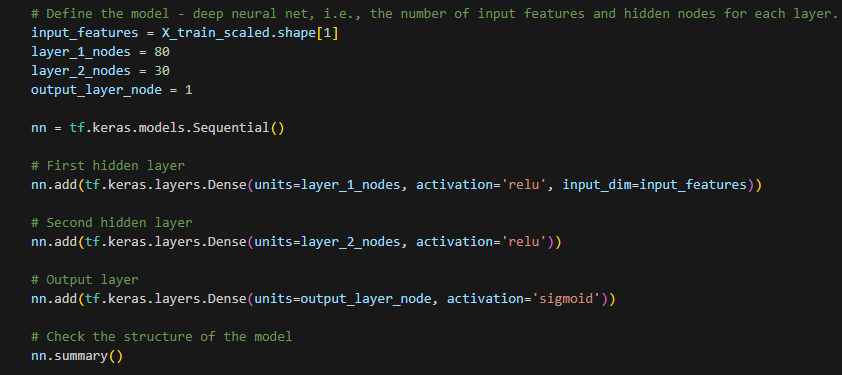
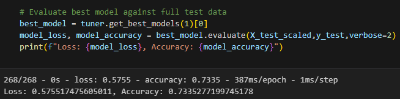
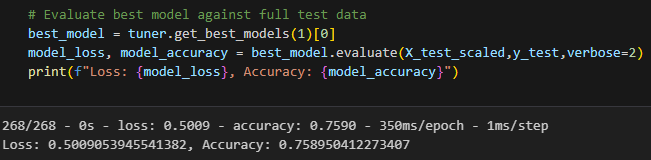
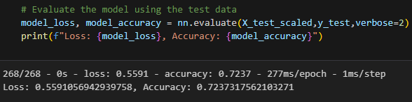

## Neural Network Model Report

## Overview of the Analysis

Using machine learning and neural networks, I used the features in the provided dataset to create a binary classifier that can predict whether applicants will be successful if funded by Alphabet Soup.
For this analysis I had the dataset in a csv containing multiple organizations that have received funding from Alphabet Soup.
Below are the steps required:
  * Preprocess the data
  * Compile, Train and Evaluate the Model
  * Optimise the model

## Results

* Data Preprocessing
  * Target variable was "IS_SUCCESSFUL" Column
  * All Columns except for "IS_SUCCESSFUL" were features
  * "EIN" and "NAME" Columns were removed from the data
* Compiling, Training, and Evaluating the Model
  * I used 80 and 30 neurons for the first and second layer and 1 neuron for the output layer. The activation function used for the first 2 layers is "relu" and for the output layer is "sigmoid".
  
  * The model I used did not achieve the target model performance and the accuracy remained under 75%
  
  * I used 3 different optimisation methods to increase the model's performance
    * Used kerastuner to get the best model but accuracy for the best model remains below 75%
    
    * Added "NAME" Column back to the the dataset as used it as a feature by binning it and used kerastuner to get the best model with and accuracy of 75%
    
    * Used the dataset without "EIN" and "Name" Columns and updated layer 2 nodes to 40 and added a third layer with 16 nodes and used "relu" function for the 3 layers and "sigmoid" for the output layer. Also updated the epochs to 50 but the accuracy remained under 75%
    

## Summary

After using multiple optimisation techniques, none of the model's performance was above 75%. Some other model like Random Forest could be used to improve the performance for this dataset as it can handle categorical variables without the need for one-hot encoding and as they are robust to overfitting.

